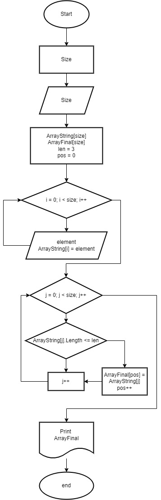

# **Итоговая проверочная работа на курсе Разработчик GeekBrains**

*Данная работа необходима для проверки знаний по итогу прохождения первого блока обучения на программе разработчик.*

## **Задачи:**
    1. Создание репозитория на GitHub.
    2. Нарисовать блок-схему алгоритма.
    3. Снабдить репозиторий оформленным текстовым описанием решения.
    4. Написать программу, решающую поставленную задачу.
    5. Использовать контроль версий в работе над этим проектом.

**Задача:** Написать программу, которая из имеющигося массива строк формирует массив из строк, длина которых меньше либо равна 3 символам. Первоначальный массив можно ввести с клавиатуры, либо задать на старте выполнения алгоритма. При решении не рекомендуется пользоваться коллекциями, лучше обойтись исключительно массивами.  

____

## Задача 1
Создан репозиторий: https://github.com/MaksimMalkovV/Final_Project.git

## Задача 2
Была разработа блок- схема

## Задание 3 
Создал файл README.md (вы его читаете ;) )

## Задание 4 
Нвписал программу, решающую поставленную задачу.

## Задача 5
В работе был использован GitHub

